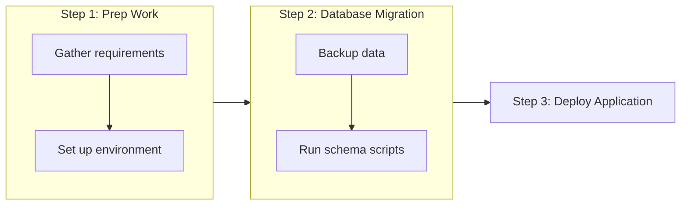

# Systems_Genomics_2025

## PROJECT DESCRIPTION 
Pipeline for analysing RNASeq raw data from [Krausgruber et al. (2020)](https://www.nature.com/articles/s41586-020-2424-4) [1]

Dataset considered was specifically limited to samples in the control and LMCV-infected endothelial cells in the liver and the brain 

## GENERAL WORKFLOW

## REFERENCES 
[1] Krausgruber, T., Fortelny, N., Fife-Gernedl, V. et al. Structural cells are key regulators of organ-specific immune responses. Nature 583, 296–302 (2020). https://doi.org/10.1038/s41586-020-2424-4
